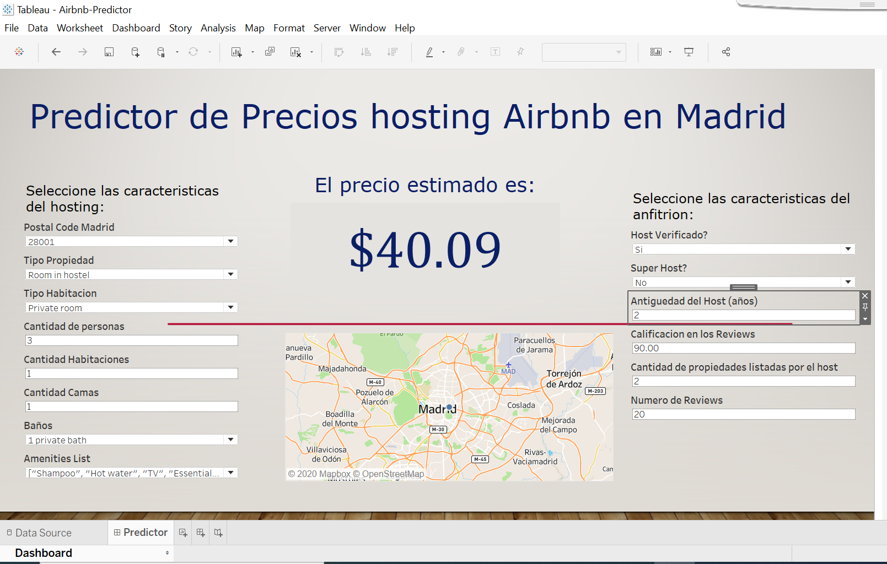
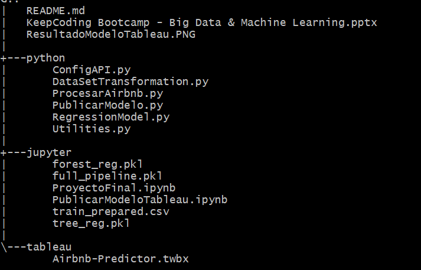

# Proyecto Final BootCamp Big Data y Machine Learning V
## Predictor de precios Airbnb

### Presentado por Claudia Sánchez
----------------------------------------------------------------------------------------------------

### Idea general
Este proyecto desarrolla el ejemplo clasico de predicción de precios de los hosting de Airbnb para la ciudad de Madrid usando algoritmos de Machine Learning, posteriormente se consumira este algoritmo por medio de ** Tableau ** donde en funcion de parametros del reporte se realizara la predicción del costo por noche del hosting

### Obtención de los datos
Obtenemos los datos del sitio [Inside Airbnb](http://insideairbnb.com/get-the-data.html) y lo combinamos con **Geocoding API** de google para obtener el codigo postal del host a partir de latitud y longitud.

### Preparacion de los datos
Se verifican todas las columnas del dataset y se seleccionan las que puedan tener relevancia para la prediccion del precio. 

Tambien aplicamos tecnicas de:

- Limpieza de datos
- Imputación de datos faltantes
- Codificacion de variables categoricas
- Estandarizacion de variables numericas

### Aplicacion de modelos de Machine Learning
Aplicamos los modelos de regresion para determinar cual es el que mejor se acopla al problema a resolver, por lo que se hacen pruebas y optimizaciones para los algoritmos:

- LinearRegression
- DecisionTreeRegressor
- RandomForestRegressor
- SVR

En Train el algoritmo dió mejores resultados fue DecisionTreeRegressor, pero al ejecutar sobre los datos de validacion determinamos que el modelo padecia de Overfitting, por lo que ejecutamos nuevamente usando tecnicas de cross-validation usando GridSearchCV, con los que obtenemos los hiper parametros que mejores resultados nos brindan sin llevar a ser overfitting, en este caso se concluye con un RandomForestRegressor profundidad 8 con 41 estimadores.

El detalle completo de todo el analisis tecnico se encuentra en los notebooks de la carpeta **jupyter** de este proyecto, especificamente el notebook [ProyectoFinal.ipynb](./jupyter/ProyectoFinal.ipynb)

Run in Google Colab: 

### Consumir el modelo
Finalmente pero no menos importante tenemos como consumir el modelo, el modelo ya entrenado se consume desde tableau, para ello hemos publicado en TabPy una función que realiza las transformaciones necesarias y consume el modelo que fue entrenado en las fases previas.

El detalle de como se prepara el modelo y se publica en TabPy lo puede ver en el notebook [PublicarModeloTableau.ipynb](./jupyter/PublicarModeloTableau.ipynb)

Run in Google Colab: 

Donde finalmente obtenemos la prediccion en base a los parametros de entrada configurados en tableau desktop

Esta parte finalizaria con la publicación del workbook en tableau server, donde ya quedaria disponible para el consumo de los usuarios finales, pero requiere otra infraestructura para su implementacion.

## Estructura de archivos dentro del proyecto:
Este proyecto esta compuesto por 3 carpetas de acuerdo a la estructura siguiente:

- **python**: En esta carpeta tenemos los codigos fuentes en python del proyecto
- **jupyter**: Contiene los notebooks con todos los pasos detallados de todo el proceso, desde la obtencion de los datos hasta la publicacion del modelo en tableau
- **tableau**: Contiene el worbook final que se conecta a tabpy para consumir el modelo y brindar la predicción

